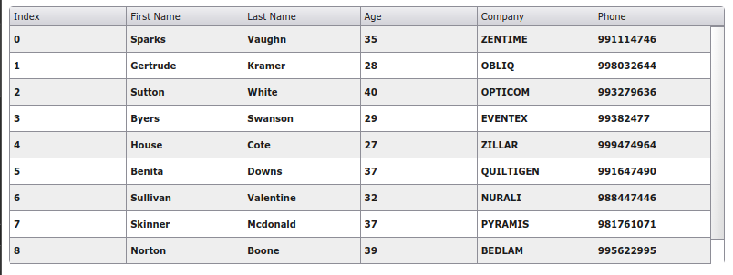
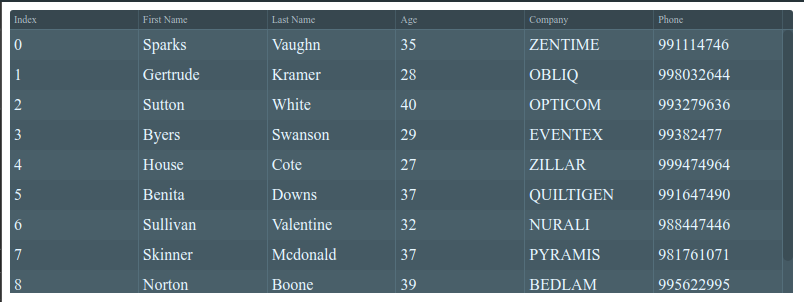
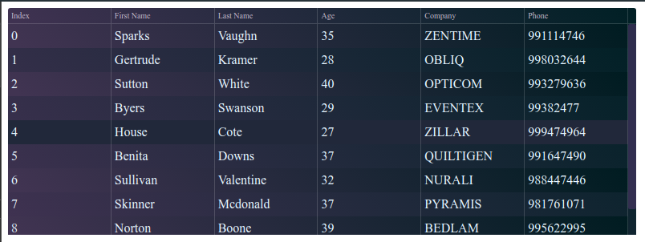
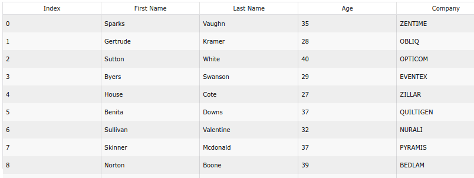

# xGrid v2.0

<p>O xGrid é um grid robusto, possui inúmeras funcionalidades, com uma alta performance. É um componente desenvolvido apenas com javascript sem uso de bibliotecas externas.</p>

<h4>Principais Funcionalidades</h4>
<ul>
    <li>Carregar os dados através de um objeto JSON.</li>
    <li>Pesquisar com mecanismo de paginação.</li>
    <li>Redimensionar tamanho das colunas.</li>
    <li>Vincular campos do formulário com os dados do grid.</li>
    <li>Ordenação dos dados.</li>
    <li>Diversas possibilidade de filtragem dos dados.</li>
    <li>Totalizar valores de uma coluna.</li>
    <li>É possível vincular botões (inserir,alterar,deletar,salvar, cancelar, entre outros).</li>
    <li>Fácil inserção, alteração e remoção de dados</li>
    <li>Dentre outras funcionalidades...
</ul>

## Instalação

Clone o repositório em um diretório local.

```sh
    git clone git@github.com:dffrancisco/xGridV2.git
```
## Importando

Em seu html declare o css:
```html
    <link rel="stylesheet" href="./xGridV2.css">
```

Para usar o xGrid você deve chamá-lo em seu arquivo .js através de import.
```javascript
    import xGrid from './xGridV2';
```
## Modo de Uso

É necessário um elemento no seu html com um id ou classe para usar na instância do xGrid.

```html
    <!DOCTYPE html>
    <html lang="pt-BR">
    <head>
        <title>xGrid v2.0</title>
        <link rel="stylesheet" href="./xGridV2.css">
    </head>
    <body>
        <div id="pnGrid"></div>
        <script src="./xGridV2.js"></script>
        <script src="example.js" type="module"></script>
    </body>
    </html>
```
No javascript iremos instanciar o objeto da seguinte forma:

<h4>Create</h4>

```javascript
    const grid = new xGrid.create({
        el: '#pnGrid'
    })

    grid.source(json);
```
## Temas

<p>O xGrid vem com 4 estilos de temas que podem ser informado dentro do create, os temas são: </p>

<table>
    <tr>
        <th>Gray</th>
        <th>Dark</th>
    </tr>
    <tr>
        <td></td>
        <td></td>
    </tr>
    <tr>
        <td style="font-size: 10px; text-align:center; padding: 0px">x-grayV2</td>
        <td style="font-size: 10px; text-align:center; padding: 0px">x-darkV2</td>
    </tr>
</table>
<table>
     <tr>
        <th>Opacity</th>
        <th>White</th>
    </tr>
    <tr>
        <td></td>
        <td></td>
    </tr>
    <tr>
        <td style="font-size: 10px; text-align:center; padding: 0px">x-opaciteV2</td>
        <td style="font-size: 10px; text-align:center; padding: 0px">x-whiteV2</td>
    </tr>
</table>

## Parâmetro Create

Create é responsável por instanciar o xGrid. Recebe um objeto como parâmetro que pode ter as seguintes propriedades passadas:

<table>
    <tr>
        <th align="center" width="20%">Propriedade</th>
        <th align="center" width="50%">Descrição</th>
        <th align="center" width="15%">Tipo</th>
        <th align="center" width="15%">Default</th>
    </tr>
    <tr>
        <td>el</td>
        <td>Id ou classe do elemento onde será instanciado o xGrid. <strong>(Obrigatório)</strong></td>
        <td align="center">String</td>
        <td align="center"></td>
    </tr>
    <tr>
        <td>source</td>
        <td>Dados que irão popular o grid.</td>
        <td align="center">Array of Object (JSON)</td>
        <td align="center">[empty]</td>
    </tr>
    <tr>
        <td>width</td>
        <td>Largura do grid.</td>
        <td align="center">Numeric</td>
        <td align="center"></td>
    </tr>
    <tr>
        <td>height</td>
        <td>Altura do grid.</td>
        <td align="center">Numeric</td>
        <td align="center"></td>
    </tr>
    <tr>
        <td>heightLine</td>
        <td>Altura da linha do grid.</td>
        <td align="center">Numeric</td>
        <td align="center">30</td>
    </tr>
    <tr>
        <td>setFocus</td>
        <td>Inicia o grid focado na linha informada.</td>
        <td align="center">Numeric</td>
        <td align="center"></td>
    </tr>
    <tr>
        <td>theme</td>
        <td>Informe a classe do tema que deseja utilizar. Lista de <a href=#temas>temas</a> disponíves acima.</td>
        <td align="center">String</td>
        <td align="center">x-grayV2</td>
    </tr>
    <tr>
        <td>title</td>
        <td>Visibilidade da barra de título</td>
        <td align="center">Boolean</td>
        <td align="center">true</td>
    </tr>
    <tr>
        <td>count</td>
        <td>Visibilidade do contador/índice na primeira coluna.</td>
        <td align="center">Boolean</td>
        <td align="center">false</td>
    </tr>
    <tr>
        <td>multiSelect</td>
        <td>Possibilita a seleção de múltiplas colunas ao segurar a tecla CTRL.</td>
        <td align="center">Boolean</td>
        <td align="center">false</td>
    </tr>
    <tr>
        <td>onSelectLine</td>
        <td>Define uma função que será executada ao selecionar alguma linha.<br>
        Callback retorna os dados da linha selecionada.
        </td>
        <td align="center">Function<br>(Callback)</td>
        <td align="center"></td>
    </tr>
    <tr>
        <td>click</td>
        <td>Define uma função que será executada ao clicar em alguma linha.<br>
        Callback retorna os dados da linha selecionada.
        </td>
        <td align="center">Function<br>(Callback)</td>
        <td align="center"></td>
    </tr>
    <tr>
        <td>dblClick</td>
        <td>Define uma função que será executada ao dar um duplo clique em alguma linha.<br>
        Callback retorna os dados da linha selecionada.
        </td>
        <td align="center">Function<br>(Callback)</td>
        <td align="center"></td>
    </tr>
    <tr>
        <td>enter</td>
        <td>Define uma função que será executada ao pressionar enter em alguma linha.<br>
        Callback retorna os dados da linha selecionada.
        </td>
        <td align="center">Function<br>(Callback)</td>
        <td align="center"></td>
    </tr>
    <tr>
        <td>keySelectUp</td>
        <td>Define um array com teclas que ao serem pressionadas (individualmente) irão selecionar uma linha acima.
        </td>
        <td align="center">Array of Integer</td>
        <td align="center"></td>
    </tr>
    <tr>
        <td>keySelectDown</td>
        <td>Define um array com teclas que ao serem pressionadas (individualmente) irão selecionar uma linha abaixo.
        </td>
        <td align="center">Array of Integer</td>
        <td align="center"></td>
    </tr>
</table>
<br>
<table>
    <tr>
        <td><strong>onKeyDown</strong></td>
        <td>Armazena funções que executam determinada ação ao pressionar uma tecla desejada na linha do grid.<br>
        As funções possuem dois parâmetros de callback:<br>
        O <u>primeiro</u> retorna todos os campos e valores daquela linha.<br>
        O <u>segundo</u> retorna o evento keydown do DOM.
        </td>
        <td align="center">Object</td>
        <td align="center"></td>
    </tr>
    <tr>
        <td colspan=4>
        <pre>
    const grid = new xGridV2.create({
        onKeyDown: {
            70: (ln,e) => {
                alert('Letra F pressionada');
            },
            'ctrl+13': (ln,e) => {
                alert('CTRL + Enter pressionado');
            },
        },
    })</pre>
        <blockquote>A chave do objeto deve ser o keyCode da tecla que deseja monitorar.</blockquote>
        <blockquote>Pode combinar as palavras ctrl, alt e shift com um sinal de '+' .</blockquote>
        </td>
    </tr>
</table>
<br>
<table>
    <tr>
        <td id="tdCreateCompare"><strong>Compare</strong></td>
        <td>Armazena funções que serão utilizadas em uma ou mais colunas para editar seu conteúdo.<br>
        As funções possuem um parâmetro de callback que retorna todas as colunas e seus valores, e uma propriedade value que retorna o valor da coluna que está sendo executada a função.
        </td>
        <td align="center">Object</td>
        <td align="center"></td>
    </tr>
    <tr>
        <td colspan=4>
        <pre>
    const grid = new xGridV2.create({
        compare: {
            'joinName': (r) => {
                return r.firstName + r.lastName;
            },
        },
        columns: {
            'name' : {dataField: 'firstName', compare: 'joinName'},
        }
    })
        </pre>
        </td>
    </tr>
</table>
<br>
<table>
    <tr>
        <td><strong>Columns</strong></td>
        <td>Define as colunas que serão apresentadas no grid e como será personalizado os dados daquela coluna.<br>
        Caso não seja informado o componente irá considerar todas as colunas que vierem nos dados que serão adicionados ao grid.</td>
        <td align="center">Object</td>
        <td align="center"></td>
    </tr>
    <tr>
        <td colspan=4>
            <pre>           const grid = new xGridV2.create({
                columns: {
                    'First Name': { propriedades },
                    'Last Name': { propriedades }
                }
            })
            &nbsp;
            columns: {Name: {dataField: 'NAME', width: '100%'},}</pre>
            <blockquote>A chave das columns serão usadas como título das colunas no grid.</blockquote>
            <table>
                <tr>
                    <th>Propriedade</th>
                    <th>Descrição</th>
                    <th>Tipo</th>
                    <th>Default</th>
                </tr>
                <tr>
                    <td>dataField</td>
                    <td>Nome da chave que representa aquela coluna no objeto de dados.</td>
                    <td align="center">String</td>
                    <td align="center"></td>
                </tr>
                <tr>
                    <td>width</td>
                    <td>Tamanho da coluna em porcentagem. ex.: '15%'</td>
                    <td align="center">String</td>
                    <td align="center"></td>
                </tr>
                <tr>
                    <td>class</td>
                    <td>Adiciona a(s) classe(s) na coluna. ex.: 'classA classB'</td>
                    <td align="center">String</td>
                    <td align="center"></td>
                </tr>
                <tr>
                    <td>style</td>
                    <td>Adiciona um estilo na coluna. ex.: '{color: red; font-size: "16px"}'</td>
                    <td align="center">String</td>
                    <td align="center"></td>
                </tr>
                <tr>
                    <td>center</td>
                    <td>Centraliza o texto da coluna.</td>
                    <td align="center">Boolean</td>
                    <td align="center">False</td>
                </tr>
                <tr>
                    <td>right</td>
                    <td>Alinha o texto da coluna à direita.</td>
                    <td align="center">Boolean</td>
                    <td align="center">False</td>
                </tr>
                <tr>
                    <td>render</td>
                    <td>Recebe uma função com um parâmetro callback (valor da coluna), processa o valor e o return da função é mostrado.<br><pre>
columns: {
    'Data': {dataField: 'DATA', render: formatDateBR},
        }</pre>
                    </td>
                    <td align="center">Function<br>(Callback)</td>
                    <td align="center"></td>
                </tr>
                <tr>
                    <td>compare</td>
                    <td>Informa o nome da função fornecida em <a href="#tdCreateCompare">compare</a> do create que deseja aplicar a esta coluna.
<pre>grid = new xGrid.create({
    columns: {'Name': {dataField: 'NAME', compare: 'reverse'},},
    compare: {'reverse': (r)=>{
        return r.value.split('').reverse().join('');
    }}
})</pre>
                    </td>
                    <td align="center">String</td>
                    <td align="center"></td>
                </tr>
            </table>
        </td>
    </tr>
</table>
<br>
<table>
    <tr>
        <td id="filter"><strong>Filter</strong></td>
        <td>Define regras que serão utilizadas no filtro interno do grid quando executar o método filter.</td>
        <td align="center">Object</td>
        <td align="center"></td>
    </tr>
    <tr>
        <td colspan=4>
            <table>
                <tr>
                    <th>Propriedade</th>
                    <th>Descrição</th>
                    <th>Tipo</th>
                    <th>Default</th>
                </tr>
                <tr>
                    <pre>   grid = new xGrid.create({
            filter: {
                filterBegin: false,
                fieldByField: {conditional: 'OR'},
                concat: {
                    fields: [],
                    conditional: 'OR'
                }
            },
        })</pre>
                    <td id="filterBegin">filterBegin</td>
                    <td>O texto pesquisado tem que ser igual ao texto inicial da(s) coluna(s)</td>
                    <td align="center">Boolean</td>
                    <td align="center">False</td>
                </tr>
                <tr>
                    <td>fields</td>
                    <td>Array com o nome das colunas (dataField) em que deseja que a pesquisa seja realizada.<br>
                    Se não for informado irá pesquisar em todas as colunas.
                    </td>
                    <td align="center">Array</td>
                    <td align="center">[  ]</td>
                </tr>
                <tr>
                    <td id="filterConditional">conditional</td>
                    <td>Operador que determina se a pesquisa deve atender todas as colunas informadas ('AND') ou se deve atender pelo menos uma das colunas ('OR')<br>
                    </td>
                    <td align="center">String</td>
                    <td align="center">'OR'</td>
                </tr>  
            </table>
        </td>
    </tr>
</table>
<br>
<table>
    <tr>
        <td id="query"><strong>query</strong></td>
        <td>Configura o componente para uma pesquisa com paginação.</td>
        <td align="center">Object</td>
        <td align="center"></td>
    </tr>
    <tr>
        <td colspan=4>
            <pre>
grid = new xGrid.create({
    query: {
        endScroll: 0.1,
        execute: async (r) => {
            let result = await fetch('https://www.googleapis.com/books/v1/volumes
            ?q=' + r.param.desc + '&startIndex=' + r.offset + '&maxResults=' + r.param.maxItem )
            .then(response => {
                return response.json();
            })
            grid.querySourceAdd(result.items);
        }
    }
})
<br>
grid.queryOpen({ desc: 'sherlock', maxItem: 20 })</pre>
            <blockquote>Ao usar o query iniciar a busca dos dados com o método <a hreF="#queryOpen">queryOpen()</a> .</blockquote>
            <blockquote>A função chamada em execute quando processada tem que adicionar os dados no grid através do método <a href="#querySourceAdd">querySourceAdd()</a> .</blockquote>
            <table>
                <tr>
                    <th>Propriedade</th>
                    <th>Descrição</th>
                    <th>Tipo</th>
                    <th>Default</th>
                </tr>
                <tr>
                    <td>endScroll</td>
                    <td>Percentual correspondente a posição restante da barra de rolagem que buscará novos dados.</td>
                    <td align="center">Object</td>
                    <td align="center">0.1</td>
                </tr>
                <tr>
                    <td>execute</td>
                    <td>Função a ser executada para consultar novos dados, pode consumir um banco de dados, API, etc.<br><br>
                    É executada sempre quando chegar no percentual da barra de rolagem determinada em endScroll.<br><br>
                    A função possui um parâmetro callback que é um objeto contendo:<br>
                    <u>offset</u>: A posição onde deve iniciar a pesquisa. O índice do primeiro item é 0.<br>
                    <u>page</u>: A página onde será feita a pesquisa. O índice da primeira página é 1.<br>
                    <u>param</u>: Objeto contendo informações adicionais para serem utilizadas na pesquisa.
                    </td>
                    <td align="center">Function<br>(Callback)</td>
                    <td align="center">Undefined</td>
                </tr>
            </table>
        </td>
    </tr>
</table>
<br>
<table>
    <tr>
        <td id="sideBySide"><strong>sideBySide</strong></td>
        <td>Possibilita vincular as colunas do grid com os elementos do formulário (input, checkbox, textarea, etc..).</td>
        <td align="center">Object</td>
        <td align="center"></td>
    </tr>
    <tr>
        <td colspan=4>
            <pre>       const grid = new xGrid({
                sideBySide: {
                    el: '#myForm'
                }
            })
            <blockquote>O vínculo só é feito se o <strong>name</strong> dos elementos (input, etc..) for igual ao <strong>dataField</strong> de columns.</blockquote></pre>
            <table>
                <tr>
                    <th>Propriedade</th>
                    <th>Descrição</th>
                    <th>Tipo</th>
                    <th>Default</th>
                </tr>
                <tr>
                    <td>el <strong>(Obrigatório)</strong></td>
                    <td>Informe o id ou class do form ou div dos elementos de entrada.</td>
                    <td align="center">String</td>
                    <td align="center">Undefined</td>
                </tr>
                <tr>
                    <td>render</strong></td>
                    <td>Recebe um objeto, sendo a chave do objeto o 'name' do elemento e o valor uma função callback que recebe o valor do elemento e retorna um valor modificado pela função.
                     <pre>... sideBySide: {
        el: '#myForm',
        render: {
            name: (value) => {return value.split('').reverse().join('')},
            money: (value) => formatMoney
        }
    }, </pre>
                    </td>
                    <td align="center">Object</td>
                    <td align="center"></td>
                </tr>
                <tr>
                    <td>compare</strong></td>
                    <td>Recebe um objeto, sendo a chave do objeto o 'name' do elemento e o valor o nome da função fornecida em <a href="#tdCreateCompare">compare</a> do create.
<pre>grid = new xGrid.create({
    compare: {'joinName': (r)=>{
        return r.firstName + ' ' + r.lastName;
    }},
    sideBySide: {
        el: '#myForm',
        compare: {
            firstName: 'joinName',
        }
    }
})</pre>
                    </td>
                    <td align="center">Object</td>
                    <td align="center"></td>
                </tr>
                <tr>
                    <td id="frame"><strong>frame</strong></td>
                    <td>Possibilita a criação de botões que estarão vinculados com o formulário.</td>
                    <td align="center">Object</td>
                    <td align="center"></td>
                </tr>
                <tr>
                    <td colspan=4>
            <pre>
            const grid = new xGrid.create({
                sideBySide:{
                    frame: {
                        el: '#divButtons',
                        buttons: {
                            ...
                        }
                    }
                }
            })</pre>
                        <table>
                            <tr>
                                <th>Propriedade</th>
                                <th>Descrição</th>
                                <th>Tipo</th>
                                <th>Default</th>
                            </tr>
                            <tr>
                                <td>el<br>(Obrigatório)</td>
                                <td>Id ou classe do elemento onde serão criados os botões.</td>
                                <td align="center">String</td>
                                <td align="center"></td>
                            </tr>
                            <tr>
                                <td>class</td>
                                <td>Informa uma classe para o container.</td>
                                <td align="center">String</td>
                                <td align="center"></td>
                            </tr>
                            <tr>
                                <td>style</td>
                                <td>Informa uma css para o container.</td>
                                <td align="center">String</td>
                                <td align="center"></td>
                            </tr>
                            <tr>
                                <td>buttons</td>
                                <td>Lista de objetos contendo os botões que serão criados.</td>
                                <td align="center">Object</td>
                                <td align="center"></td>
                            </tr>
                            <tr>
                                <td colspan=4>
                    <pre>
                    frame: {
                        el: '#divButtons',
                        buttons: {
                            insert: {
                                html: 'Incluir',
                                state: xGrid.state.insert,
                                class: 'btnInsert',
                                click: ()=>{ ... },
                            },
                            ...
                        }
                    }</pre>
                    <blockquote>Ao clicar nos botões com state (insert, update), os fields são habilitados e os botões com state (update, cancel) são desabilitados. O contrário também se aplica.</blockquote>
                                    <table>
                                        <tr>
                                            <th>Propriedade</th>
                                            <th>Descrição</th>
                                            <th>Tipo</th>
                                            <th>Default</th>
                                        </tr>
                                        <tr>
                                            <td>html</td>
                                            <td>Texto que será exibido no botão.</td>
                                            <td align="center">String</td>
                                            <td align="center"></td>
                                        </tr>
                                        <tr>
                                            <td>state</td>
                                            <td>Propriedade para controlar qual o tipo do botão sendo utilizado.<br>
                                            <blockquote>state.insert, state.update, state.delete, state.save e state.cancel</blockquote>
                                            </td>
                                            <td align="center">state</td>
                                            <td align="center"></td>
                                        </tr>
                                        <tr>
                                            <td>class</td>
                                            <td>Fornece uma classe para o botão.</td>
                                            <td align="center">String</td>
                                            <td align="center"></td>
                                        </tr>
                                        <tr>
                                            <td>style</td>
                                            <td>Fornece uma estilo para o botão.</td>
                                            <td align="center">String</td>
                                            <td align="center"></td>
                                        </tr>
                                        <tr>
                                            <td>click</td>
                                            <td>Recebe uma função que será executada ao clicar no botão.
                                            Possui um callback que retorna os dados da linha selecionada.</td>
                                            <td align="center">Function<br>(callback)</td>
                                            <td align="center"></td>
                                        </tr>
                                    </table>
                                </td>
                            </tr>
                        </table>
                    </td>
                </tr>
                <tr>
                    <td id="duplicity"><strong>duplicity</strong></td>
                    <td>Ao sair de um elemento verifica se o seu valor já está sendo utilizado em outro registro.</td>
                    <td align="center">Object</td>
                    <td align="center"></td>
                </tr>
                <tr>
                    <td colspan=4>
                        <pre> duplicity: {
            dataField: ['id'],
            execute: async (r) => {
                let result = await fetch('https://www.googleapis.com/books/v1/volumes?
                q=' + r.value + '&maxResults=1')
                    .then(response => {
                        return response.json();
                    })
                if (result.totalItems > 0) {
                    grid.showMessageDuplicity('O campo ' +r.text+ ' está com valor duplicado!')
                    grid.focusField(r.field);
                }
            }
        },</pre>
                        <table>
                            <tr>
                                <th>Propriedade</th>
                                <th>Descrição</th>
                                <th>Tipo</th>
                                <th>Default</th>
                            </tr>
                            <tr>
                                <td>dataField</td>
                                <td>Array contendo os nomes dos fields que deseja verificar se há duplicidade.</td>
                                <td align="center">Array of String</td>
                                <td align="center"></td>
                            </tr>
                            <tr>
                                <td>execute</td>
                                <td>Função a ser executada para verificar se o dado está duplicado.<br>
                                É executada sempre quando o elemento do formulário perde o foco.<br>
                                Possui um parâmetro callback que retorna um objeto contendo:<br>
                                <u>field</u>: Nome do dataField do campo.<br>
                                <u>value</u>: Valor alterado no elemento.<br>
                                <u>text</u>: Texto do elemento anterior ou placeholder.
                                </td>
                                <td align="center">Function <br>(callback)</td>
                                <td align="center"></td>
                            </tr>
                        </table>
                    </td>
                </tr>
            </table>
        </td>
    </tr>
</table>

## Métodos
    
Esses métodos serão utilizados no grid instanciado. Ex.:<br>
```javascript
    grid.deleteLine(1);
```

<table>
    <tr>
        <th>Método</th>
        <th align="center">Parâmetro</th>
        <th>Descrição</th>
    <tr>
    <tr>
        <td>source</td>
        <td align="center">source: Array of Object</td>
        <td>Preenche o grid com os dados passados via parâmetro.</td>
    </tr>
    <tr>
        <td>sourceAdd</td>
        <td align="center">source: Array of Object</td>
        <td>Insere os dados passados via parâmetro no grid.</td>
    </tr>
    <tr>
        <td>dataSource</td>
        <td align="center">nenhum</td>
        <td>Retorna os dados da linha selecionada.<br>
        Caso nenhuma linha tenha sido selecionada, retorna false.
        </td>
    </tr>
    <tr>
        <td>dataSource</td>
        <td align="center">field: String</td>
        <td>Retorna o valor da coluna informada por parâmetro na linha selecionada.</td>
    </tr>
    <tr>
        <td>dataSource</td>
        <td align="center">field: String<br>value: String</td>
        <td>Altera o valor da coluna informada pelo valor passado, na linha selecionada.</td>
    </tr>
    <tr>
        <td>data</td>
        <td align="center">nenhum</td>
        <td>Retorna todos os dados armazenados no grid.</td>
    </tr>
    <tr>
        <td>getColumns</td>
        <td align="center">nenhum</td>
        <td>Retorna as informações da propriedade 'columns' do grid.</td>
    </tr>
    <tr>
        <td>getCompare</td>
        <td align="center">nenhum</td>
        <td>Retorna as informações da propriedade 'compare' do grid.</td>
    </tr>
    <tr>
        <td>focus</td>
        <td align="center">numLine: Integer</td>
        <td>Foca na linha informada. Primeira linha iniciada por 0.</td>
    </tr>
    <tr>
        <td>disable</td>
        <td align="center">callback: Function<br>(Optional)</td>
        <td>Desabilita o grid, executa a função callback caso tenha sido passada.</td>
    </tr>
    <tr>
        <td>enable</td>
        <td align="center">callback: Function<br>(Optional)</td>
        <td>Habilita o grid, executa a função callback caso tenha sido passada.</td>
    </tr>
    <tr>
        <td>clear</td>
        <td align="center">callback: Function<br>(Optional)</td>
        <td>Apaga os dados do grid (visual). Os dados permanecem armazendados no grid. Executa a função callback caso tenha sido passada.</td>
    </tr>
    <tr>
        <td>load</td>
        <td align="center">nenhum</td>
        <td>Mostra uma mensagem de loading no grid.</td>
    </tr>
    <tr>
        <td>load</td>
        <td align="center">text: String</td>
        <td>Mostra a mensagem fornecida como um loading no grid.</td>
    </tr>
    <tr>
        <td>load</td>
        <td align="center">text: String,<br>
            callback: Function
        </td>
        <td>Mostra a mensagem fornecida como um loading no grid. Executa a função callback fornecida.</td>
    </tr>
    <tr>
        <td>closeLoad</td>
        <td align="center">callback: Function<br>(Optional)</td>
        <td>Oculta a mensagem de loading do grid. Executa a função callback caso tenha sido passada.</td>
    </tr>
    <tr>
        <td>getIndex</td>
        <td align="center">nenhum</td>
        <td>Retorna o índice da linha atual. A primeira linha se inicia com 0.</td>
    </tr>
    <tr>
        <td>deleteLine</td>
        <td align="center">index: Integer <br>(Optional)</td>
        <td>Deleta a linha informada, caso não informe a linha, será deletado a linha selecionada.<br>
        Essa função tem como retorno os dados da linha deletada.
        </td>
    </tr>
    <tr>
        <td>insertLine</td>
        <td align="center">param: Object</td>
        <td>Insere uma linha com os dados passados no final do grid.
        </td>
    </tr>
    <!-- <tr>
        <td>insertLine</td>
        <td align="center">param: <br>Object, <br>order: </td>
        <td>
        </td>
    </tr>
    <tr>
        <td>insertLine</td>
        <td align="center">
        param: <br>
        Object,<br>
        order: <br>
        type, <br>
        callback: <br>
        Function <br>
        </td>
        <td>
        </td>
    </tr> -->
    <tr>
        <td>sumDataField</td>
        <td align="center">field: String</td>
        <td>Retorna a soma total da coluna informada.
        </td>
    </tr>
    <tr>
        <td>queryOpen</td>
        <td align="center">param: Object,<br>
        callback: Function<br>
        (Optional)
        </td>
        <td>Faz uma consulta inicial com base na propriedade <a href="#query">query</a>. As demais consultas são feitas com paginação através da query. Executa uma função callback caso tenha sido fornecida. (<a href="query">query</a>)</td>
    </tr>
    <tr>
        <td>querySourceAdd</td>
        <td align="center">source: Array of Object
        </td>
        <td>Adiciona os dados passados no grid.  (<a href="query">query</a>)</td>
    </tr>
    <tr>
        <td>focusField</td>
        <td align="center">name: String</td>
        <td>Foca em um campo específico do formulário.  (<a href="#sideBySide">sideBySide</a>)</td>
    </tr>
    <tr>
        <td>filter</td>
        <td align="center">filter: String,<br>
        callback: Function (Optional)
        </td>
        <td>Pesquisa e filtra no grid o texto passado. A pesquisa obedece a condição informada na propriedade <a href="#filter">filter</a>.<br>
        Executa uma função callback caso tenha sido fornecida, essa função callback têm como parâmetro de retorno a quantidade de linhas encontradas. (<a href="filter">filter</a>)
    </tr>
    <tr>
        <td>filter</td>
        <td align="center">filter: Object,<br>
        callback: Function (Optional)
        </td>
        <td>Pesquisa nas colunas informadas os respectivos valores informados. Ex.:<br>
        <code>grid.filter({name: 'Robert' lastName: 'Drummond'})</code><br>
         A pesquisa obedece a condição informada na propriedade <a href="#filter">filter</a>.<br>
        Executa uma função callback caso tenha sido fornecida, essa função callback têm como parâmetro de retorno a quantidade de linhas encontradas. (<a href="filter">filter</a>)
    </tr>
    <tr>
        <td>setFilterBegin</td>
        <td align="center">filterBegin: Boolean</td>
        <td>Altera a propriedade <a href="#filterBegin">filterBegin</a> do filter. (<a href="filter">filter</a>)
    </tr>
    <tr>
        <td>setFilterConditional</td>
        <td align="center">conditional: String</td>
        <td>Altera a propriedade <a href="#filterConditional">conditional</a> do filter. (<a href="filter">filter</a>)
    </tr>
    <tr>
        <td>disableBtnsSalvarCancelar</td>
        <td align="center">disable: Boolean
        </td>
        <td>Desabilita/Habilita os botões salvar e cancelar de acordo com a informação passada. (<a href="#frame">frame</a>)
        </td>
    </tr>
    <tr>
        <td>disableFieldsSideBySide</td>
        <td align="center">disable: Boolean
        </td>
        <td>Desabilita/Habilita os campos do formulário. (<a href="#sideBySide">sideBySide</a>)
        </td>
    </tr>
    <tr>
        <td>getElementSideBySideJson</td>
        <td align="center">toUpperCase: Boolean,<br>
        empty: Boolean
        </td>
        <td>Retorna os valores dos campos do formulário no formato JSON. (<a href="#sideBySide">sideBySide</a>)
        </td>
    </tr>
    <tr>
        <td>getDiffTwoJson</td>
        <td align="center">toUpperCase: Boolean</td>
        <td>Retorna um objeto contendo os valores antigos e novos dos campos alterados no formulário.<br>
        <code> {objOld: [name: 'Robert'], objNew: [name: 'Roberty']}</code>
        (<a href="#sideBySide">sideBySide</a>)
        </td>
    </tr>
    <tr>
        <td>clearElementSideBySide</td>
        <td align="center">nenhum</td>
        <td>Limpa os campos do formulário.
        (<a href="#sideBySide">sideBySide</a>)
        </td>
    </tr>
    <tr>
        <td>print</td>
        <td align="center">headHTML: String (Optional)
        </td>
        <td>Imprime os dados do grid. É possível passar um cabeçalho para impressão via parâmetro.
        </td>
    </tr>
    <tr>
        <td>getDuplicityAll</td>
        <td align="center">nenhum</td>
        <td>Chama a função execute de <a href="#duplicity">duplicity</a> dos fields informados.</td>
    </tr>
    <tr>
        <td>showMessageDuplicity</td>
        <td align="center">text: String</td>
        <td>Mostra uma mensagem de alerta!</td>
    </tr>
    <tr>
        <td>setKeySelectUp</td>
        <td align="center">keyCode: Integer</td>
        <td>Adiciona a opção de selecionar a linha acima com a tecla informada.</td>
    </tr>
    <tr>
        <td>setKeySelectDown</td>
        <td align="center">keyCode: Integer</td>
        <td>Adiciona a opção de selecionar a linha abaixo com a tecla informada.</td>
    </tr>
</table>

## Desenvolvedores

[Francisco Alves](https://github.com/dffrancisco)<br>
[Guilherme Trindade](https://github.com/guigagb)